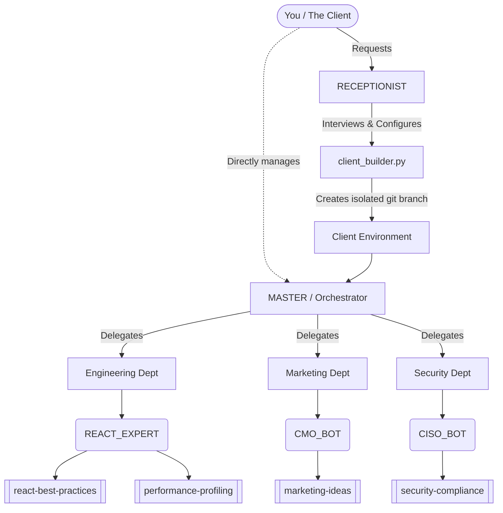

# 🌌 Antigravity — Your AI Dream Team Operating System

> **80+ Specialized AI Agents • 709+ Agentic Skills • One-Command Client Onboarding**
>
> Turn any AI coding assistant into a full-service digital agency with specialized departments, an executive orchestrator, and an automated client branch builder.

---

## 🚀 The Vision

Antigravity isn't just a list of prompts. It is a **multi-agent orchestration framework**. 

Instead of treating your AI as a generic coding assistant, Antigravity structures it into an executive **Dream Team**. You talk to the **MASTER** (Chief of Staff), and the MASTER delegates tasks to 80+ specialized **Personas** (e.g., React Expert, Legal Counsel, QA Director), who in turn utilize a library of **709+ Agentic Skills**.



---

## 🏢 The Architecture

### 1. The Executive (`MASTER.md`)
You never talk to the specialists directly. You talk to the [MASTER](.antigravity/personas/MASTER.md). The MASTER's job is to analyze your request, read the `persona_menu.md`, assemble the right squad of agents, and orchestrate the workflow.

### 2. The Personas (80+ Agents)
Divided into 10 specialized departments. Each persona has a defined mission, constraints, and a specific "toolkit" of skills they are allowed to use.
*(See [.antigravity/docs/persona_menu.md](.antigravity/docs/persona_menu.md) for the full roster).*

### 3. The Skills (709+ Capabilities)
Executable markdown files containing step-by-step procedures, templates, and best practices. Agents load these skills on demand to perform tasks.
*(See [.antigravity/skills/README.md](.antigravity/skills/README.md) for the directory).*

### 4. The `SKILL_CREATOR`
If a task requires a skill that doesn't exist, the system invokes the `SKILL_CREATOR` persona to write a new, standardized `SKILL.md` file on the fly and save it to the database for future use.

---

## 🛠️ The Client Builder (Branch Isolation)

When you onboard a new client, they don't need all 80+ agents and 700+ skills clogging up their context window. 

Antigravity uses a **Client Builder** system to create isolated, bespoke environments.

### Step 1: The Interview
You invoke the [RECEPTIONIST](.antigravity/personas/RECEPTIONIST.md) persona. The Receptionist interviews you about the new client (Name, Industry, Tech Stack, Goals).

### Step 2: Formulating the Squad
Based on your answers, the Receptionist selects the exact 4-5 Personas and 10-15 Skills the client actually needs.

### Step 3: Branch Generation
The Receptionist provides a command using `client_builder.py`.
```bash
python3 client_builder.py --name "Acme Corp" --personas PRODUCT_VISIONARY REACT_EXPERT --skills react-best-practices
```
This script automatically:
1. Creates a new git branch (`client/acme_corp`).
2. Copies only the selected personas and skills.
3. Generates a custom `MASTER.md` acting as the dedicated orchestrator for Acme Corp.
4. Purges all unused Antigravity files from that branch.
5. Pushes to origin.

---

## 🏃 Quick Start Guide

You can use Antigravity in three ways:

### Option 1: The Full Engine (Advanced)
Use the entire repository globally.
1. Add the Antigravity folder to your AI assistant's workspace.
2. Prompt: *"Read `.antigravity/personas/MASTER.md`. You are now the Master."*
3. Give the Master a task: *"Build a weather app."*

### Option 2: The Receptionist Flow (Recommended)
Let the AI guide you through building a client environment.
1. Prompt: *"Read `.antigravity/personas/RECEPTIONIST.md`. You are the Receptionist."*
2. Answer the Receptionist's questions.
3. Run the python command it generates for you.
4. `git checkout client/your-new-client`

### Option 3: Manual Client Build
Run the builder script yourself if you already know what you need:
```bash
python3 client_builder.py \
  --name "My Project" \
  --personas NEXTJS_GURU UI_ARCHITECT \
  --skills nextjs-best-practices tailwind-design-system
```

---

## 📂 Project Structure

```
Antigravity/
├── client_builder.py                 # The branch automation script
├── .antigravity/                     # Core system folder
│   ├── CLIENT_MASTER_TEMPLATE.md     # Template for client-specific orchestrators
│   ├── rules.md                      # Global system laws and constraints
│   ├── docs/
│   │   ├── AGENT_PROTOCOL.md         # The rules for how agents talk to each other
│   │   ├── persona_menu.md           # The master roster of all 80+ agents
│   │   └── PARANOIC_TEST.md          # System validation tests
│   ├── personas/
│   │   ├── MASTER.md                 # The Chief Orchestrator
│   │   ├── RECEPTIONIST.md           # The Onboarding Specialist
│   │   ├── SKILL_CREATOR.md          # The Skill Generator
│   │   └── ... (78 other specialists)
│   └── skills/
│       ├── README.md                 # Skills directory overview
│       └── ... (709+ specialized skill folders)
```

---

## 🎭 The 10 Departments (Persona Highlights)

1.  **🏛️ Executive & Strategy:** `CHIEF_OF_STAFF`, `PRODUCT_VISIONARY`, `STARTUP_STRATEGIST`
2.  **🚀 Growth & Marketing:** `CMO_BOT`, `GROWTH_HACKER`, `SEO_TECHNICAL`
3.  **🎨 Design & Experience:** `UX_RESEARCHER`, `UI_ARCHITECT`, `3D_WIZARD`
4.  **🧠 Data & AI:** `PROMPT_ENGINEER`, `RAG_SPECIALIST`, `AI_ARCHITECT`
5.  **🛡️ Security:** `CISO_BOT`, `RED_TEAMER`, `SMART_CONTRACT_AUDITOR`
6.  **⚡ Frontend & Mobile:** `REACT_EXPERT`, `FLUTTER_DEV`, `IOS_ENGINEER`
7.  **⚙️ Backend & Infrastructure:** `GO_ENGINEER`, `RUST_SYSTEMS`, `DBA_POSTGRES`
8.  **☁️ Cloud & DevOps:** `KUBERNETES_PILOT`, `DEVOPS_AUTOMATOR`, `SERVERLESS_DEV`
9.  **🧪 Quality Assurance:** `QA_DIRECTOR`, `E2E_AUTOMATOR`, `TDD_MENTOR`
10. **🏢 Operations & Admin:** `HR_DIRECTOR`, `LEGAL_COUNSEL`, `FINANCE_CONTROLLER`

Review the full roster in [`persona_menu.md`](.antigravity/docs/persona_menu.md).
